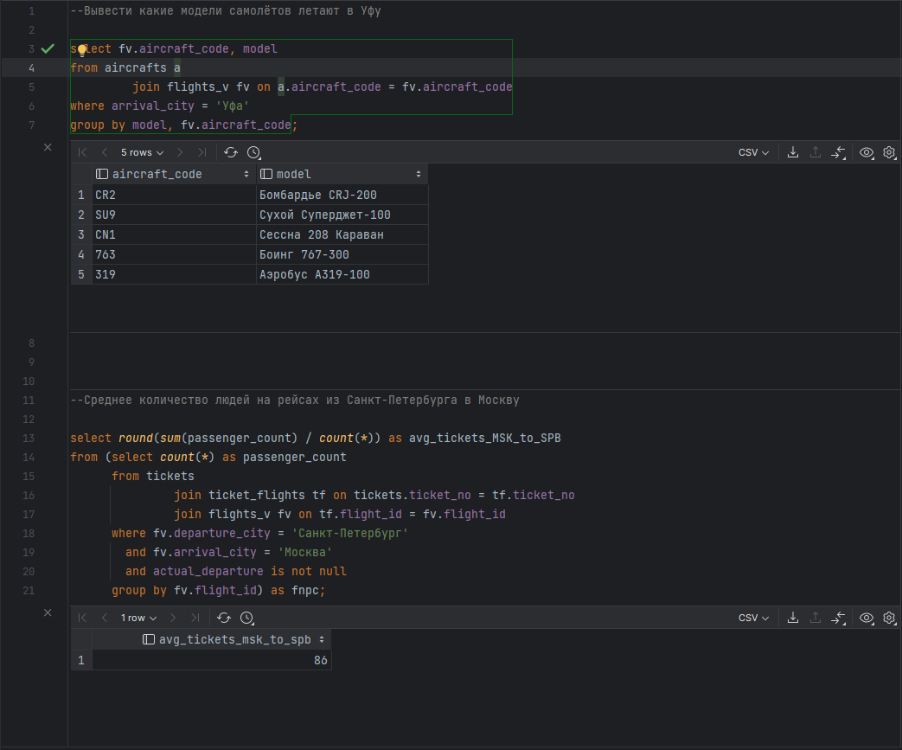
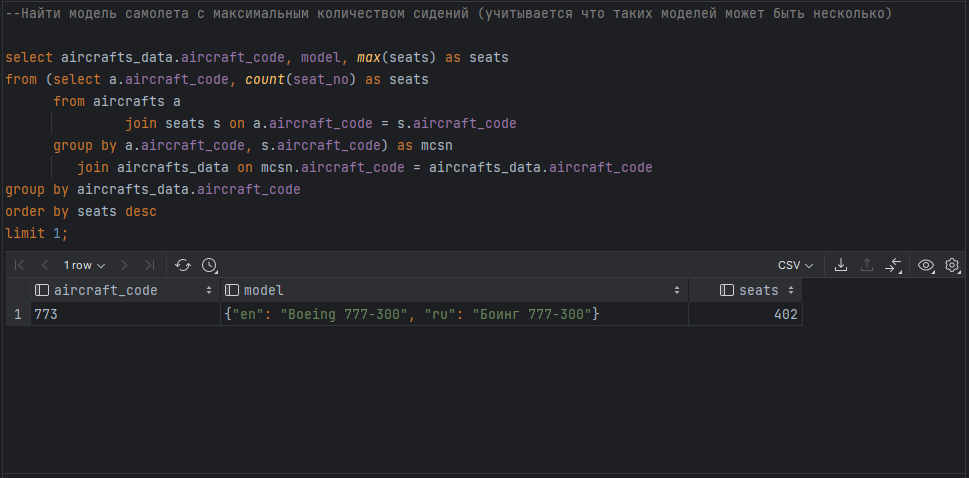
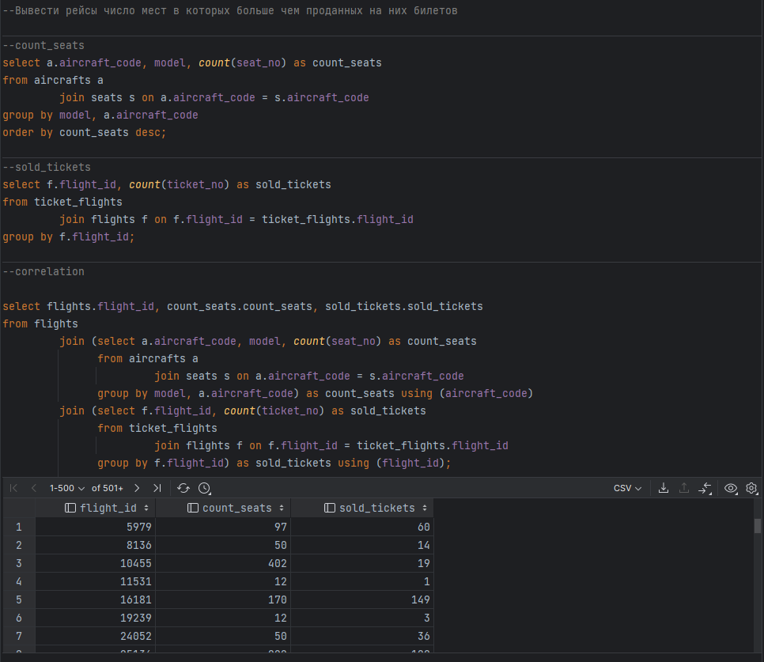
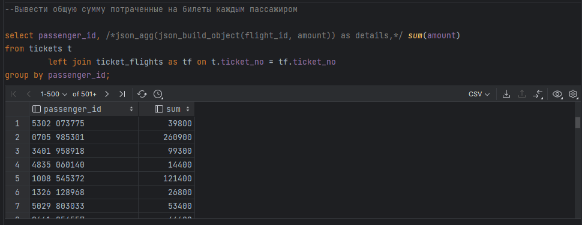
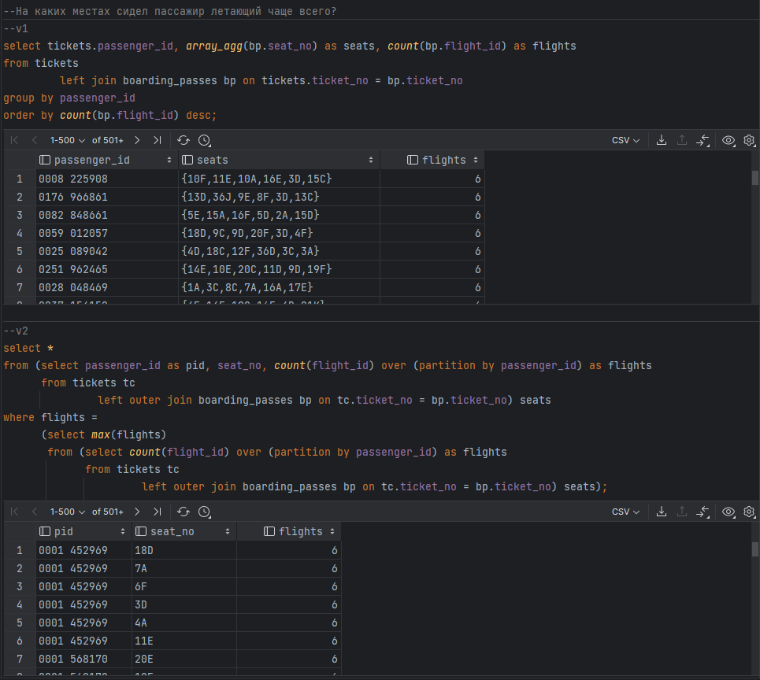
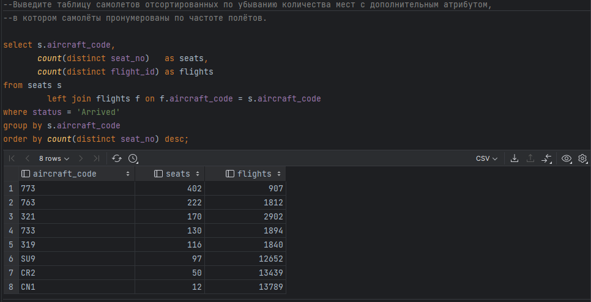

**Восстанавливаем базу** demo-medium**-**20170815.sql

cat ./demo-medium-20170815.sql \| docker exec -i postgres psql -U
postgres -d postgres

**Выполненные запросы:**

{width="7.479330708661418in"
height="6.222222222222222in"}

{width="7.479166666666667in"
height="2.6271325459317585in"}

{width="7.479330708661418in"
height="6.486111111111111in"}

{width="7.479330708661418in"
height="2.9027777777777777in"}

{width="7.479166666666667in"
height="6.075049212598425in"}

{width="7.479330708661418in"
height="3.8194444444444446in"}

**Ответы на вопросы:**

1)  Дана таблица:

> Table1

  -----------------------------------------------------------------------
  ID            NAME                        CLASS_ITEM
  ------------- --------------------------- -----------------------------
  1             Арфа                        A

  2             аккордеон                   NULL

  3             Барабан                     B

  4             рояль                       NULL

  5             труба                       A

  6             Пианино                     C
  -----------------------------------------------------------------------

> Что выведет следующий запрос и почему:
>
> SELECT \* FROM Table1 WHERE CLASS_ITEM \<\> 'A';

Результат:

  -----------------------------------------------------------------------
  ID            NAME                        CLASS_ITEM
  ------------- --------------------------- -----------------------------
  3             Барабан                     B

  6             Пианино                     C
  -----------------------------------------------------------------------

> Выражение "NULL \<\>" не существует т.к нельзя неопределенность
> сравнивать с определенным значением.

2)  Какие значения выведут следующие операции и объясните почему:

    a.  NULL \<\> 1

> →null. Сравнение типа NULL 'Оператор сравнения' не существует(ответ на
> 1 вопрос)

b.  NULL \<\> NULL

> →null

c.  NULL = NULL

> →null

d.  NULL IS NOT NULL

> →false

e.  NULL IS NULL

> →true

3)  Дана таблица:

> Table1

  -----------------------------------------------------------------------
  ID            NAME                        CLASS_ITEM
  ------------- --------------------------- -----------------------------
  1             Арфа                        A

  2             аккордеон                   NULL

  3             Барабан                     B

  4             рояль                       NULL

  5             труба                       A

  6             Пианино                     C
  -----------------------------------------------------------------------

> Какие строчки вернет следующий запрос:
>
> SELECT \* FROM Table1 WHERE NAME LIKE 'A%';
>
> Результат:

  -----------------------------------------------------------------------
  ID            NAME                        CLASS_ITEM
  ------------- --------------------------- -----------------------------
  1             Арфа                        A

  -----------------------------------------------------------------------

> [Оператор LIKE проверяет соответствие выражению с учётом
> регистра]{.mark}

4)  Дана таблица:

> Table1

  -----------------------------------------------------------------------
  ID            NAME                        CLASS_ITEM
  ------------- --------------------------- -----------------------------
  1             Арфа                        A

  2             аккордеон                   NULL

  3             Барабан                     B

  4             рояль                       NULL

  5             труба                       A

  6             Пианино                     C
  -----------------------------------------------------------------------

> Какие строчки вернет следующий запрос:
>
> SELECT \* FROM Table1 WHERE UPPER(NAME) LIKE 'A%';
>
> Результат:

  -----------------------------------------------------------------------
  ID            NAME                        CLASS_ITEM
  ------------- --------------------------- -----------------------------
  1             АРФА                        A

  2             АККОРДЕОН                   NULL
  -----------------------------------------------------------------------

5)  Имеется две таблицы Т1 и Т2. Известно, что в таблице Т1 - 3 строчки,
    > а в таблице Т2 - 4 строчки.

> Не зная какие цифры лежат в графах NOM обеих таблиц, необходимо
> предположить какое минимальное и какое максимальное количество строчек
> может вернуть запрос ниже:
>
> SELECT \* FROM T1 LEFT JOIN T2 ON T1.NOM = T2.NOM;
>
> Ответ:
>
> LEFT JOIN --- это тоже самое что и INNER JOIN (т.е. все комбинации
> соединений строк, отфильтрованных по какому-то условию), и плюс еще
> записи из левой таблицы, для которых в правой по этому фильтру ничего
> не совпало. Следовательно минимально количество строк равно 3, а
> максимальное 3\*4=12

6)  Найдите ошибку в SQL запросе:

> SELECT ID_ITEM, NAME_ITEM, EXTRACT(YEAR FROM DATE_IMPORT) AS
> YEAR_IMPORTANCE FROM Table1 WHERE YEAR_IMPORTANCE \> 2010;
>
> Правильный запрос:
>
> SELECT ID_ITEM, NAME_ITEM, EXTRACT(YEAR FROM DATE_IMPORT) AS
> YEAR_IMPORTANCE FROM Table1 WHERE EXTRACT(YEAR FROM DATE_IMPORT) \>
> 2010;
>
> Ошибка в том, что нельзя использовать псевдонимы в операторе WHERE,
> определенные в операторе SELECT, который выполняется последним.
