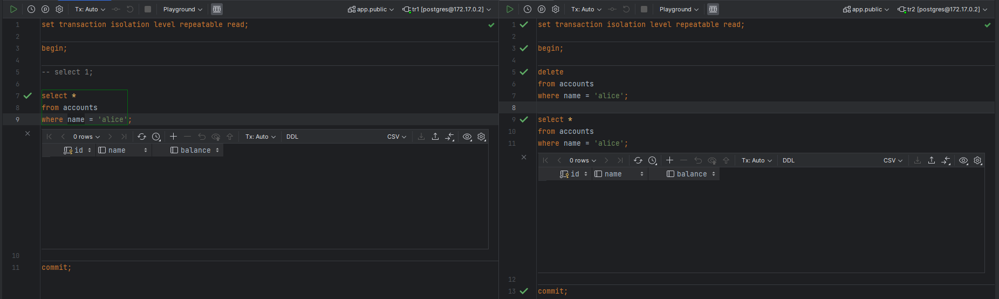

**Стандарт SQL содержит 4 уровня изоляции:**

> Read uncommitted -- не поддерживается PostgreSQL. Позволяет читать не
> зафиксированные данные. Другими словами, одна транзакция не успела
> зафиксировать некоторые данные, а другая уже может их прочитать.
>
> Read committed -- используется по умолчанию. Система строит
> согласованные снимки состояний по любому запросу (SELECT, INSERT,
> UPDATE). Даже если в 1 транзакции несколько операторов, все они будут
> создавать свои снимки. Например, вы выполняете команду SELECT, которая
> выполняется 5 мнут. Но она будет работать со своим снимком данных.
> Если в этот момент другой запрос что-то поменяет в таблицах, то ваш
> SELECT это проигнорирует. Второй SELECT построит свой снимок данных и
> может вернуть другой результат.
>
> Repeatable read -- снимок строится на момент транзакции, а не
> отдельного оператора. Это нужно, если в транзакции много разных
> операторов и они должны видеть согласованные данные на один и тот же
> момент времени.
>
> Serializable -- полная изоляция. Используются блокировки так, чтобы
> пересекающиеся транзакции работали последовательно и не мешали друг
> другу. Если транзакции захотят обратиться к одним и тем же данным
> может получиться ситуация, когда одна транзакция завершиться успешно,
> а другая не завершиться. Если приложение работает в этом режиме, то
> оно должно уметь повторно выполнять транзакции, которые небыли
> выполнены.

**Задание 1:**

1.  Создайте новую базу данных в PostgreSQL включающие две таблицы:
    > \"accounts\" и \"transactions\". Таблица \"accounts\" должна
    > содержать следующие поля: id (уникальный идентификатор), name
    > (имя), balance (баланс). Таблица \"transactions\" должна содержать
    > следующие поля: id (уникальный идентификатор), account_id (ссылка
    > на id в таблице \"accounts\"), amount (сумма).

> {width="6.851091426071741in"
> height="3.664093394575678in"}

2.  Проведите проверку что PostgreSQL не допускается аномалия **грязного
    > чтения**, объясните почему.

> {width="6.267716535433071in"
> height="3.5277777777777777in"}
>
> В транзакции tr1 снимаем 200 у.е со счета алисы, но не фиксируем
> изменения, при этом эти изменения видны внутри tr2. Начинаем
> транзакцию tr2, проверяем баланс алисы и видим что баланс не изменился
> т.к его изменение в tr1 не зафиксировано.
>
> Грязное чтение не допускается за счет использования изоляции на основе
> снимков данных, что позволяет обходиться минимумом блокировок.
> Фактически блокируется только повторное изменение одной и той же
> строки. Все остальные операции могут выполняться одновременно: пишущие
> транзакции никогда не блокируют читающие транзакции, а читающие вообще
> никогда никого не блокируют.

3.  Проверьте, что на уровне изоляции Read Committed не предотвращается
    > аномалия фантомного чтения.

> {width="6.267716535433071in"
> height="3.5277777777777777in"}

4.  Начните транзакцию с уровнем изоляции Repeatable Read(и пока не
    > выполняйте в ней никаких команд). В другом сеансе удалите строку и
    > зафиксируйте изменения.

> {width="6.267716535433071in" height="1.875in"}
>
> Видна ли строка в открытой транзакции? - Нет
>
> Что изменится, если в начале транзакции выполнить запрос,но не
> обращаться в нем ни к одной таблице? - Обновиться версия снапшота.
>
> {width="5.395833333333333in" height="3.0in"}
>
> {width="6.267716535433071in"
> height="0.6944444444444444in"}

5.  Напишите функцию, которая позволяет выполнить перевод средств с
    > одного счета на другой, используя транзакции. Функция должна
    > использовать уровень изоляции транзакции \"Serializable\".
    > Протестируйте функцию с использованием нескольких параллельных
    > сеансов, чтобы убедиться, что переводы не могут быть выполнены
    > дважды.

> {width="7.090674759405075in"
> height="2.5182753718285213in"}

Изоляция уровня Serializable обеспечивает беспрепятственный доступ к
базе данных транзакциям с SELECT запросами. Но для транзакций с
запросами UPDATE и DELETE, уровень изоляции Serializable не допускает
модификации одной и той же строки в рамках разных транзакций. При
изоляции такого уровня все транзакции обрабатываются так, как будто они
все запущены последовательно (одна за другой). Если две одновременные
транзакции попытаются обновить одну и туже строку, то это будет не
возможно. В таком случае PostgreSQL принудит транзакцию, вторую, да и
все последующие, что пытались изменить строку к отмене (откату ---
ROLLBACK).

> {width="7.086614173228346in"
> height="3.97244094488189in"}
>
> После того как 1 транзакция слева завершилась 2 транзакция продолжает
> выполнение функции.
>
> {width="7.028174759405075in"
> height="3.9545713035870516in"}
>
> {width="5.955258092738408in"
> height="3.917933070866142in"}
>
> При попытке выполнить перевод средств со счета отправителя с нулевым
> балансом выбросится ошибка ограничения целостности для столбца
> balance.
>
> {width="5.965674759405075in"
> height="3.6111001749781275in"}
>
> {width="7.082465004374453in"
> height="0.6867847769028871in"}

6.  Начните транзакцию Repeatable Read и выполните какой-нибудь запрос.
    > В другом сеансе создайте таблицу. Видно ли в первой транзакции
    > описание таблицы в системном каталоге? Можно ли в ней прочитать
    > строки таблицы?

> {width="6.913591426071741in"
> height="2.5901891951006126in"}
>
> {width="6.913591426071741in"
> height="1.1554746281714785in"}

7.  Убедитесь, что команда DROP TABLE транзакционна.

> DROP TABLE транзакционна т.к после удаления таблицы можно откатить
> транзакцию

{width="6.851091426071741in"
height="3.8549311023622046in"}

**Задание 2:**

1.  Установите расширение
    > [[pageinspect]{.underline}](https://www.postgresql.org/docs/15/pageinspect.html).

2.  Создать базу данных с именем versions_db. Создать таблицу users со
    > следующими полями:

    -   id: уникальный идентификатор пользователя (integer, primary key,
        > auto-increment).

    -   username: имя пользователя (varchar(255)).

    -   email: электронный адрес пользователя (varchar(255)).

    -   version: версия строки (integer).

3.  Создать триггер, который будет автоматически увеличивать поле
    > version строки при любом обновлении.

4.  Вставить в таблицу users строку с различными данными а затем
    > обновите.

> {width="6.953632983377078in"
> height="6.546875546806649in"}

5.  При помощи следующего запроса:

> **[SELECT \'(0,\'\|\|lp\|\|\')\' AS ctid,]{.mark}**
>
> **[t_xmin as xmin,]{.mark}**
>
> **[t_xmax as xmax,]{.mark}**
>
> [**CASE WHEN (t_infomask & 256) \> 0 THEN \'t\' END AS
> xmin_c,**]{.mark}
>
> [**CASE WHEN (t_infomask & 512) \> 0 THEN \'t\' END AS
> xmin_a,**]{.mark}
>
> [**CASE WHEN (t_infomask & 1024) \> 0 THEN \'t\' END AS
> xmax_c,**]{.mark}
>
> [**CASE WHEN (t_infomask & 2048) \> 0 THEN \'t\' END AS
> xmax_a**]{.mark}
>
> **[FROM
> heap_page_items(get_raw_page(\']{.mark}**users**[\',0))]{.mark}**
>
> **[ORDER BY lp;]{.mark}**
>
> Где,

-   **ctid** является ссылкой на следующую, более новую, версию той же
    > строки. У самой новой, актуальной, версии строки ctid ссылается на
    > саму эту версию

-   **xmin** и **xmax** определяют видимость данной версии строки в
    > терминах начального и конечного номеров транзакций.

-   [**xmin_c, xmin_a, xmax_c, xmax_a** содержит ряд битов, определяющих
    > свойства данной версии]{.mark}

[Выведите информацию о версиях строк, узнав сколько версий строк щас
находится в таблице и сравнить их с атрибутом (]{.mark}version[)]{.mark}

{width="7.059424759405075in"
height="2.4383530183727036in"}

{width="5.520833333333333in" height="0.84375in"}

6.  Опустошим таблицу при помощи **[TRUNCATE;]{.mark}**

7.  Начините транзакцию и вставьте новую строку и узнайте номер текущий
    > транзакции (это можно сделать при помощи след команды: **[INSERT
    > INTO users(\...) VALUES (\...) RETURNING \*, ctid, xmin,
    > xmax;]{.mark}**

8.  Поставьте точку сохранения и добавьте новую строку использовав
    > команду из пункта 7.

9.  Откатимся к точке сохранения и добавим новую строчку аналогично 7 и
    > 8 пункту.

> {width="6.799008092738408in"
> height="4.621052055993001in"}

10. Выведите сведения о версиях строк.

> {width="6.819841426071741in"
> height="3.4289173228346455in"}

**Задание 3:**

1.  Создать таблицу t с полями id(integer) и name (char(2000)) с
    > параметром filfactor = 75%.

2.  Создать индекс над полем t(name)

3.  Установите расширение
    > [[pageinspect]{.underline}](https://www.postgresql.org/docs/15/pageinspect.html).

4.  Создать представление которое будет включать в себя информацию о
    > версиях строк при помощью след запроса:

> **[CREATE VIEW t_v AS]{.mark}**
>
> **[SELECT \'(0,\'\|\|lp\|\|\')\' AS ctid,]{.mark}**
>
> [**CASE lp_flags**]{.mark}
>
> [**WHEN 0 THEN \'unused\'**]{.mark}
>
> [**WHEN 1 THEN \'normal\'**]{.mark}
>
> [**WHEN 2 THEN \'redirect to \'\|\|lp_off**]{.mark}
>
> [**WHEN 3 THEN \'dead\'**]{.mark}
>
> [**END AS state,**]{.mark}
>
> **[t_xmin \|\| CASE]{.mark}**
>
> [**WHEN (t_infomask & 256) \> 0 THEN \' (c)\'**]{.mark}
>
> [**WHEN (t_infomask & 512) \> 0 THEN \' (a)\'**]{.mark}
>
> [**ELSE \'\'**]{.mark}
>
> [**END AS xmin,**]{.mark}
>
> **[t_xmax \|\| CASE]{.mark}**
>
> [**WHEN (t_infomask & 1024) \> 0 THEN \' (c)\'**]{.mark}
>
> [**WHEN (t_infomask & 2048) \> 0 THEN \' (a)\'**]{.mark}
>
> [**ELSE \'\'**]{.mark}
>
> [**END AS xmax,**]{.mark}
>
> [**CASE WHEN (t_infomask2 & 16384) \> 0 THEN \'t\' END AS
> hhu,**]{.mark}
>
> [**CASE WHEN (t_infomask2 & 32768) \> 0 THEN \'t\' END AS
> hot,**]{.mark}
>
> **[t_ctid]{.mark}**
>
> **[FROM heap_page_items(get_raw_page(\'t\',0))]{.mark}**
>
> **[ORDER BY lp;]{.mark}**

-   флаг Heap Hot Updated показывает, что надо идти по цепочке ctid,

-   флаг Heap Only Tuple показывает, что на данную версию строки нет
    > ссылок из индексов.

{width="6.9987664041994755in"
height="3.869792213473316in"}

5.  Спроецировать ситуацию в таблице t, при которой произойдет
    > внутристраничная очистка без участия HOT-обновлений.

> {width="6.944841426071741in"
> height="5.7164359142607175in"}
>
> На 4 обновлении name произошла внутристраничная очистка.
>
> {width="6.851091426071741in"
> height="4.0362281277340335in"}

6.  После воспроизвести ситуацию но уже с HOT-обновлением

При таком обновлении в индексной странице находится лишь одна запись,
ссылающаяся на самую первую версию строки в табличной странице. А уже
внутри этой табличной страницы организуется цепочка версий:

-   строки, которые изменены и входят в цепочку, маркируются битом Heap
    > Hot Updated;

-   строки, на которые нет ссылок из индекса, маркируются битом Heap
    > Only Tuple (то есть --- «только табличная версия строки»);

-   поддерживается обычная связь версий строк через поле ctid

HOT-обновления работают в случае, если обновляемые поля не входят ни в
один индекс. Иначе в каком-либо индексе оказалась бы ссылка
непосредственно на новую версию строки, что противоречит идее этой
оптимизации.

Если при сканировании индекса PostgreSQL попадает в табличную страницу и
обнаруживает версию, помеченную как Heap Hot Updated, он понимает, что
не надо останавливаться и проходит дальше по всей цепочке обновлений.
Разумеется, для всех полученных таким образом версий строк проверяется
видимость, прежде чем они будут возвращены клиенту.

{width="7.479330708661418in"
height="6.194444444444445in"}

{width="7.479330708661418in" height="6.25in"}

## **★** Использовать фактор заполнения на 80% и на 50%, указать в отчете в чем разница между разными факторами

Fillfactor --- параметр хранения, который можно определить для таблицы
(и для индекса). PostgreSQL вставляет новую строку (INSERT) на страницу,
только если эта страница заполнена менее, чем на fillfactor процентов.
Остальное место резервируется для новых версий строк, которые получаются
в результате обновлений (UPDATE). Значение по умолчанию для таблиц равно
100, то есть место не резервируется (а значение для индексов --- 90).

Внутристраничная очистка.

> 50% - 3 обновление. Мы превысили fillfactor и произошла очистка. На
> это указывает разница между значениями pagesize и upper, равная
> 8192-4128=4064. При этом 50% от размера страницы составляет 4096
> байтов.

{width="7.017758092738408in"
height="4.232157699037621in"}

> 80% - 5 обновление. Мы превысили fillfactor и произошла очистка. На
> это указывает разница между значениями pagesize и upper, равная
> 8192-64=8128. При этом 80% от размера страницы составляет 6553 байт.

{width="6.955258092738408in"
height="4.853181321084865in"}

Все неактуальные версии строк (0,1), (0,2) и (0,3) очищены; после этого
на освободившееся место добавлена новая версия строки (0,5).

Оставшиеся после очистки версии строк физически сдвигаются в сторону
старших адресов страницы так, чтобы все свободное место было
представлено одним непрерывным фрагментом. Соответствующим образом
изменяются и значения указателей. Благодаря этому не возникает проблем с
фрагментацией свободного места в странице.
