**Задание 1.**

1.  Создать базу данных с именем vacuum_db.

2.  Создать таблицу users, отключив параметр автоочистки (CREATE TABLE
    > \... WITH (autovacuum_enabled = off);), со следующими полями:

> id: уникальный идентификатор пользователя (integer, primary key,
> auto-increment).
>
> username: имя пользователя (varchar(255)).
>
> email: электронный адрес пользователя (varchar(255)).
>
> category: категория (char(3))

3.  Написать скрипт заполняющий таблицу users 1000000 рандомными
    > записями, в поле category всегда должна находиться запись 'FOO'.

> 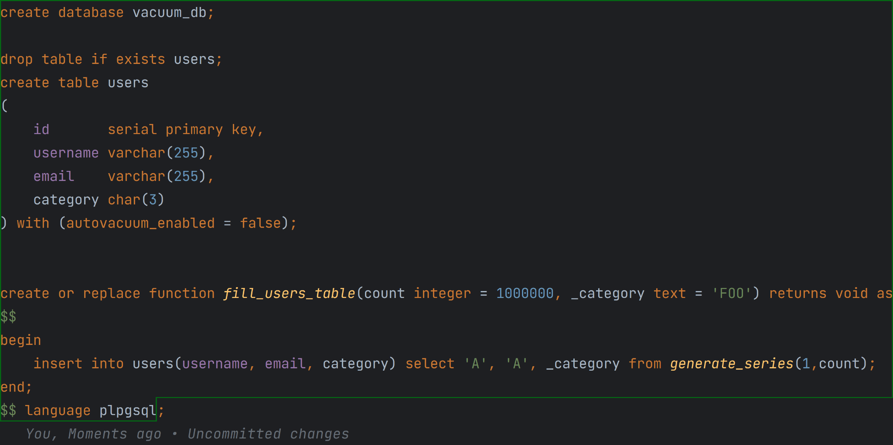{width="6.882341426071741in"
> height="3.4411701662292216in"}

4.  Используя оператор Explain выведите из таблицы users все записи
    > которые в поле category имеют значение 'FOO';

5.  Выполните команду ANALYZE;

6.  Используя оператор Explain выведите из таблицы users все записи
    > которые в поле category имеют значение 'FOO';

> 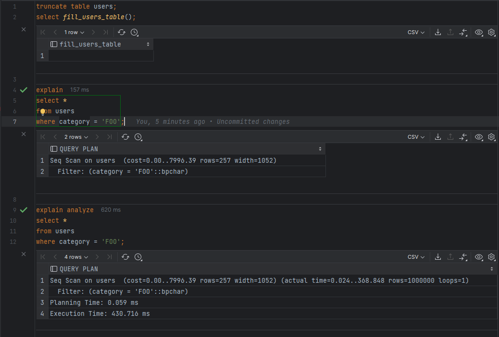{width="6.944841426071741in"
> height="4.691152668416448in"}

7.  Отличаются ли методы доступа к данным и почему

> В выводе команды **EXPLAIN** для каждого узла в дереве плана отводится
> одна строка, где показывается базовый тип узла плюс оценка стоимости
> выполнения данного узла, которую сделал для него планировщик.
>
> **EXPLAIN ANALYZE** действительно [выполняет запрос]{.underline}, хотя
> его результаты могут не показываться, а заменяться выводом команды
> EXPLAIN.
>
> Отличие в том, что что **EXPLAIN** генерирует план запроса, оценивая
> стоимость, а **EXPLAIN ANALYZE** выполняет запрос.

8.  Временно уменьшите значение *maintenance_work_mem* чтоб оно стало
    > равно 1MB (не забудьте выполнить функцию
    > **[pg_reload_conf()]{.mark}**)

9.  Измените значение поля category на 'BPP'

10. Запустите очистку **[VACUUM VERBOSE]{.mark}**. Заодно через
    > небольшое время в другом сеансе обратитесь к
    > pg_stat_progress_vacuum.

11. Верните значение *maintenance_work_mem* к исходному значению.

> 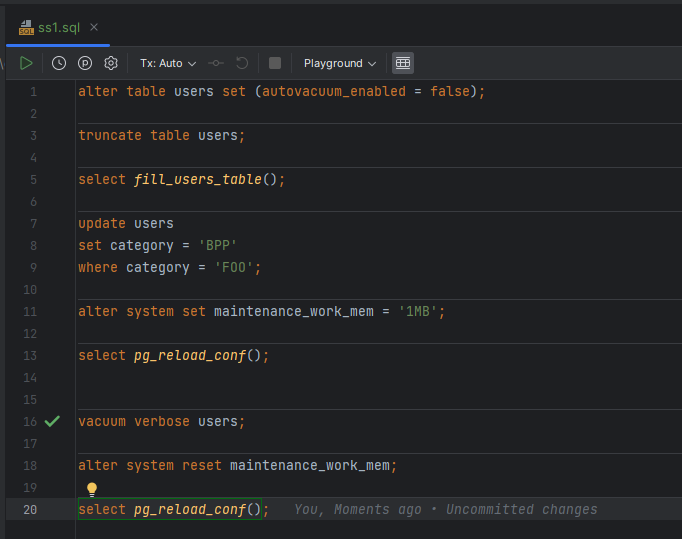{width="4.861508092738408in"
> height="3.839730971128609in"}
>
> 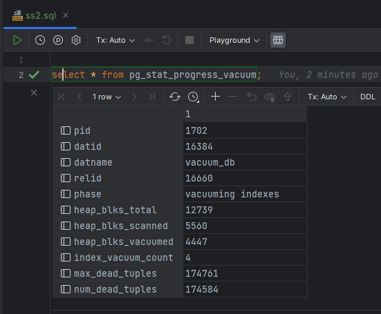{width="4.861508092738408in"
> height="4.01449365704287in"}

**Задание 2.**

1.  Узнать текущий размер файла данных таблицы users при помощи функции:
    > **[pg_size_pretty(pg_table_size(\'название таблицы\'))]{.mark}**

2.  Удалите 90% случайных строк (Случайность важна, чтобы в каждой
    > странице остались какие-нибудь не удаленные строки)

3.  Выполните очистку

4.  Ещё раз узнайте текущий размер файла данных таблицы users и сравните
    > его с первым пунктом. Объясните результат

> 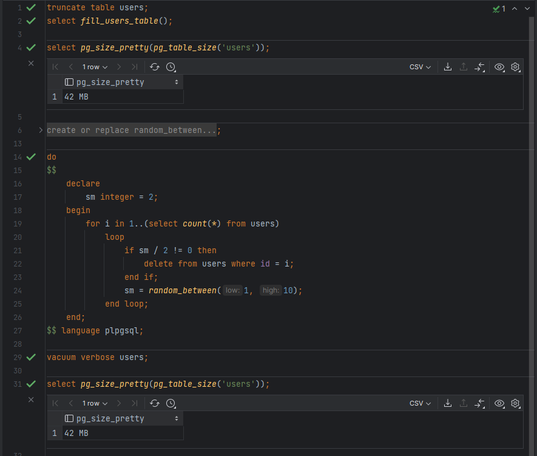{width="5.796050962379702in"
> height="4.890096237970254in"}
>
> VACUUM - высвобождает пространство, занимаемое «мёртвыми» кортежами.
> При обычных операциях Postgres Pro кортежи, удалённые или устаревшие в
> результате обновления, **физически не удаляются из таблицы**; они
> сохраняются в ней, пока не будет выполнена команда VACUUM.
>
> vacuuming \"public.users\"
>
> vacuuming \"vacuum_db.public.users\"
>
> finished vacuuming \"vacuum_db.public.users\": index scans: 1
>
> pages: 0 removed, 5406 remain, 5406 scanned (100.00% of total)
>
> tuples: **900241 removed**, 99759 remain, 0 are dead but not yet
> removable
>
> removable cutoff: 1342, which was 0 XIDs old when operation ended
>
> new relfrozenxid: 1339, which is 1 XIDs ahead of previous value
>
> index scan needed: 5406 pages from table (100.00% of total) had 900241
> dead item identifiers removed

5.  Заново заполните таблицу и повторите пункты 1 и 2.

6.  Выполните полную очистку

7.  Ещё раз узнайте текущий размер файла данных таблицы users и сравните
    > его с результатом пункта 5. Объясните результат

> 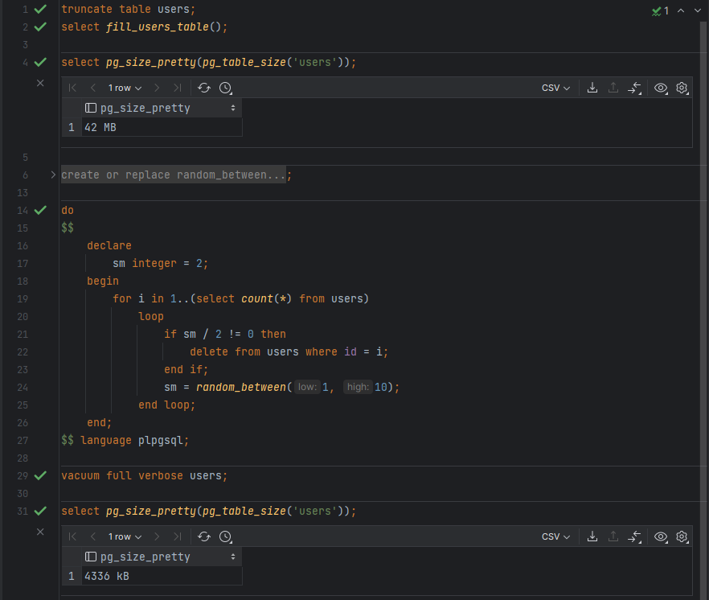{width="6.572456255468066in"
> height="5.551733377077865in"}

VACUUM FULL - режим «полной» очистки, который может освободить больше
пространства, но выполняется гораздо дольше и запрашивает исключительную
блокировку таблицы. Этот режим также требует дополнительное место на
диске, так как **он записывает новую копию таблицы и не освобождает
старую до завершения операции.** Обычно это следует использовать, только
когда требуется высвободить значительный объём пространства, выделенного
таблице.

> \"public.users\": found 900041 removable, 99959 nonremovable row
> versions in 5406 pages

В данном примере размер таблицы уменьшился до 4336 kB

Основное отличие в том, что VACUUM FULL [физически удаляет мертвые
кортежи и повторно освобождает освободившееся пространство и
перестраивает с нуля индексы. До/после vacuum full:]{.mark}

> 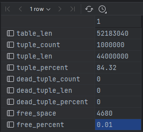{width="2.9895833333333335in"
> height="2.460605861767279in"}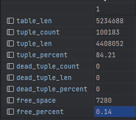{width="2.767756999125109in"
> height="2.443772965879265in"}

**Задание 3.**

1.  Включите параметр автоочистки в таблице users

2.  Настройте автоочистку на запуск при изменении 10 % строк, время
    > «сна» --- одна секунда (**[autovacuum_vacuum_threshold = 0,
    > autovacuum_vacuum_scale_factor = 0.1, autovacuum_naptime =
    > \'1s\']{.mark}**)

3.  Заполните таблицу users до 1000000 записей

4.  Узнать текущий размер файла данных таблицы users при помощи функции:
    > **[pg_size_pretty(pg_table_size(\'название таблицы\'))]{.mark}**

5.  Напишите скрипт который двадцать раз с интервалом в несколько секунд
    > изменяет по 5 % случайных строк. Каждое изменение выполняйте в
    > отдельной транзакции.

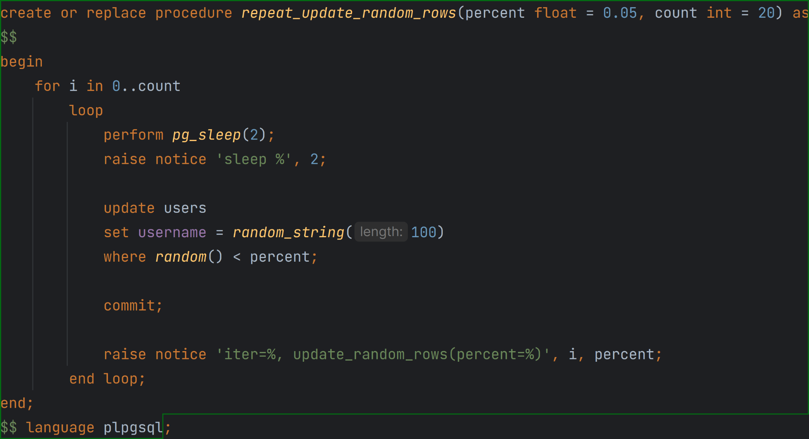{width="6.840674759405075in"
height="3.725214348206474in"}

6.  При помощи [**pg_stat_all_tables** узнайте сколько раз выполнялась
    > автоочистка.]{.mark}

autovacuum_count **=** 2

7.  [Сравнить размеры таблицы до и после обновлений]{.mark}

[65MB → 135MB]{.mark}

[]{.mark}

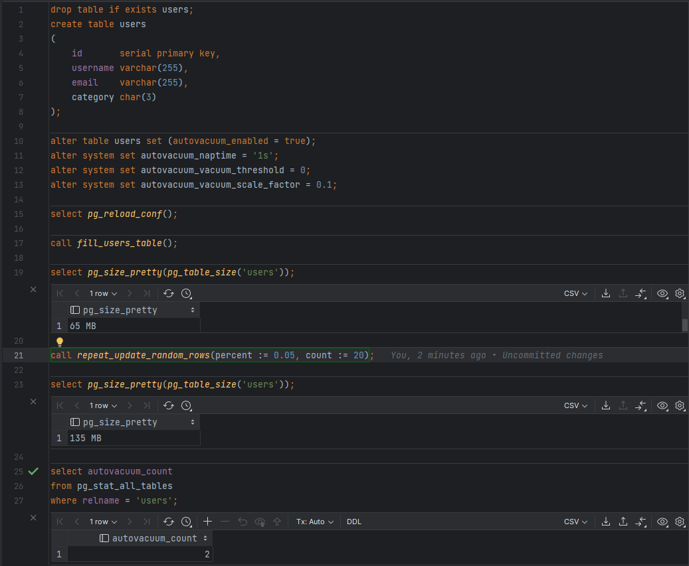{width="6.64382874015748in"
height="5.467841207349081in"}

> [autovacuum_count = 2, так как очистка срабатывает при 10% мертвых
> кортежей, а мы изменяем всего лишь 5% строк.]{.mark}
>
> [max_dead_tup =\> autovacuum_vacuum_threshsold +
> autovacuum_vacuum_scale_factor \* pg_class.reltupes = 0 + 0.1 \*
> **(0.05\*100000\*20)** = 100000]{.mark}
>
> 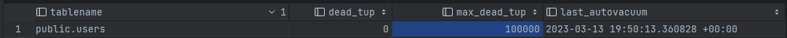{width="7.003076334208224in"
> height="0.35420166229221345in"}
